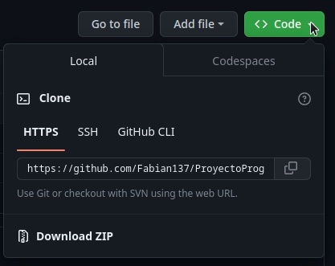
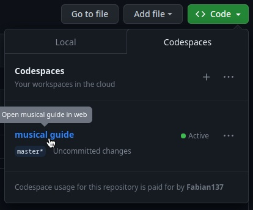
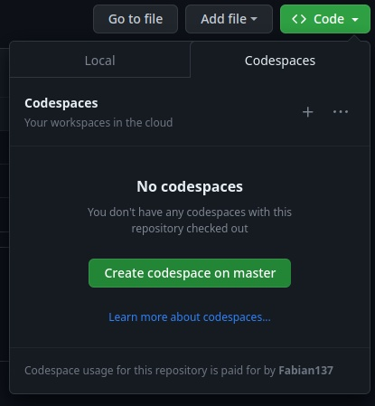
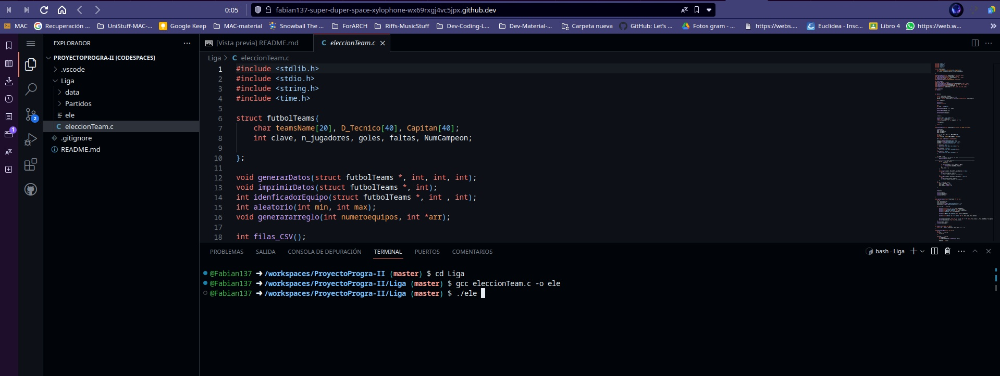

# Ejecución de la Liga en ***Codespace***


Presionamos el botón de **code** 


Nos mostrará dos opciones: **Local** y **Codespaces**


Seleccionamos **Codespaces** y hacemos click en el espacio *musical guide (O el que esté ahi)*. 



Si no aparece creamos un *codespace*. ***Create codespace on master***



Nos abrirá un espacio parecido a este 



- Entramos a la carpeta donde se encuentra el proyecto (Liga) \
```cd Liga/```

- Copilamos el código (proyecto.c). \
```gcc proyecto.c -o proyecto``` \
***Nota: Si no compila tendremos que instalar alguna extensión como C/C++***
- Ejecutamos 
```./proyecto```

## Estructura 
Dentro de la carpeta ***Liga*** están ***data*** y ***Partidos***.
- ***data*** tiene archivos que usa el programa para ejecutarse
- ***Partidos*** contiene archivos donde se encuentran las rondas que se dieron en la liga ejecutada

- El archivo a nivel de Liga ***(campeonse.csv)*** nos muestra el historial de campeones que ha existido