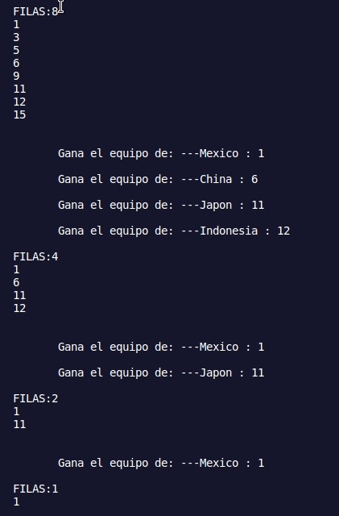

***Tengo que actualizar esta nota explicando a detalle que trato de hacer con las funciones que agregue o modifique***
 - Modificada: generarDatos
 - Modificada: enfrentamientos
 - Agregada: escrituraArchivos_Partidos
 - Agregada: iteraciones

De lo que escribi a las 01:41am del 10 de may 

# LISTO

El programa hasta ahorita puede hacer enfrentamientos 
***NOTA: agregar cómo se hace***

Puedo llamar a la función de enfrentamientos cuatro veces para que  se llegue a la final de los partidos. Asi que cambie el código para que lo repitiera hasta que ***n*** (valor de filas en el archivo "ID_teams.csv") sea igual a 1. 
- En este archivo primero se guardan las claves de los equipos del 0 al 15 (16 equipos), la asignación de equipos a estas claves es aleatorio aunque las claves estén ordenadas.
- Después suceden los enfrentamientos segun el diagrama planeado [[Generalidades]] (**Eliminatoria simple**)  y por cada enfrentamiento se va reescribiendo la clave del equipo ganador en este archivo. Asi tenemos 8 claves en el archivo, siendo los equipos ganadores
- Se repite el proceso obteniendo 4 claves
- Asi hasta una clave, la del ganador de la liga

***FILAS: # N*** Es el número de filas que se lee por ronda de enfrentamientos
asi que usare esta variable ***n*** para hacer cinco casos (16, 8, 4, 2, 1) y guardar las claves de los equipos que van avanzando. No sé si podría hacer solo un archivo para estos cinco casos, pero si pienso en la consulta me parece que será más difícil consultar en un solo archivo que en 5
